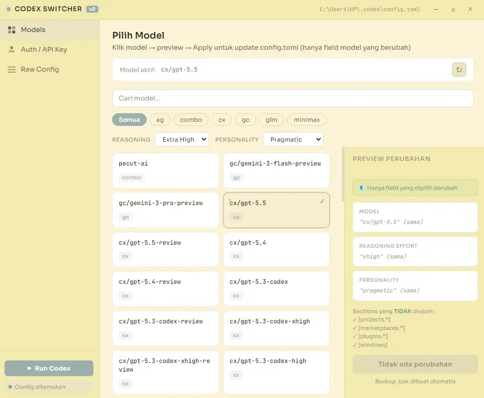
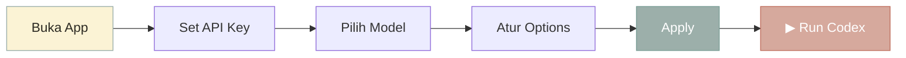

<p align="center">
  
</p>

<h1 align="center">Codex Switcher</h1>

<p align="center">
  <strong>GUI desktop untuk switch model 9Router di OpenAI Codex — tanpa edit file manual.</strong>
</p>

<p align="center">
  
  
  
  
</p>

<p align="center">
  
</p>

---

## ✨ Fitur

| Fitur | Deskripsi |
|-------|-----------|
| 🔄 **Model Switcher** | Pilih model dari list lengkap 9Router dengan 1 klik |
| 🛡️ **Config Safe** | Hanya field `model` yang berubah — sections lain 100% preserved |
| 🌐 **Dynamic Model List** | Auto-fetch model terbaru dari API, fallback ke offline list |
| 🔑 **Auth Manager** | Edit API Key & auth.json langsung dari UI |
| 🧠 **Reasoning Effort** | Atur level reasoning: Low / Medium / High |
| 🎭 **Personality** | Pilih personality: Pragmatic / Concise / Detailed / Pedagogical |
| 📝 **Raw Config Editor** | Edit manual `config.toml` & `auth.json` dengan syntax highlight |
| 💾 **Auto Backup** | File `.bak` otomatis dibuat sebelum setiap perubahan |
| ▶ **Run Codex** | Tombol 1-klik untuk langsung buka Codex CLI |
| 🔌 **Test Koneksi** | Ping API untuk verifikasi key dan konektivitas |

---

## 📥 Download & Install

### Opsi 1: Download EXE (Recommended)

> Langsung pakai, tanpa perlu install Node.js.

1. Buka halaman [**Releases**](https://github.com/Gimm17/codex-switcher-9routes/releases)
2. Download file **`Codex Switcher Setup 2.0.0.exe`**
3. Jalankan installer → pilih lokasi install → selesai!

### Opsi 2: Build dari Source

<details>
<summary><strong>Klik untuk lihat langkah build</strong></summary>

#### Prasyarat
- [Node.js](https://nodejs.org) v18+
- npm (sudah bundled dengan Node.js)

#### Langkah

```bash
# 1. Clone repo
git clone https://github.com/Gimm17/codex-switcher-9routes.git
cd codex-switcher-9routes

# 2. Install dependencies
npm install

# 3. Jalankan (dev mode)
npm start

# 4. Build jadi .exe
npm run build
```

Output EXE ada di folder `dist/`.

</details>

---

## 🚀 Cara Pakai

```
1. Buka  →  Codex Switcher
2. Tab Auth  →  masukkan API Key 9Router  →  Simpan
3. Tab Models  →  klik model  →  atur Reasoning & Personality  →  Apply
4. Klik ▶ Run Codex  →  langsung coding!
```

### Alur Kerja



---

## 🏗️ Tech Stack

| Layer | Technology |
|-------|-----------|
| Framework | Electron 28 |
| TOML Parser | [smol-toml](https://github.com/nicolo-ribaudo/smol-toml) |
| UI | Vanilla HTML + CSS + JS |
| Fonts | [Sora](https://fonts.google.com/specimen/Sora) + [JetBrains Mono](https://fonts.google.com/specimen/JetBrains+Mono) |
| Build | electron-builder → NSIS installer |

---

## 📁 Struktur Project

```
codex-switcher/
├── src/
│   ├── main.js          # Electron main process + IPC handlers
│   ├── preload.js       # Context bridge (secure IPC)
│   ├── index.html       # App layout & structure
│   ├── styles.css       # Light theme (cream palette)
│   └── renderer.js      # UI logic, model grid, preview
├── assets/
│   └── icon.png         # App icon
├── package.json
├── .gitignore
└── README.md
```

---

## 🔧 Config yang Diubah

Saat kamu klik **Apply**, app hanya mengubah field berikut di `~/.codex/config.toml`:

```toml
model = "cx/gpt-5.5"                    # ← model pilihan kamu
model_reasoning_effort = "medium"        # ← dari dropdown
personality = "pragmatic"                # ← dari dropdown

[agents.subagent]
model = "cx/gpt-5.5"                    # ← mengikuti model utama
```

> **Sections lain TIDAK disentuh:** `[projects.*]`, `[marketplaces.*]`, `[plugins.*]`, `[windows]` — semua aman.

---

## 📄 License

MIT © [Gimora Digital](https://github.com/Gimm17)

---

<p align="center">
  Made with ❤️ by <strong>Gimm / Gimora Digital</strong>
</p>
